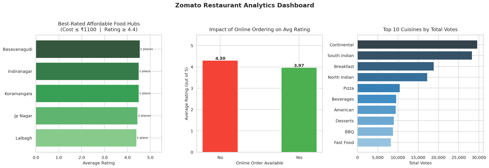

# 🍽️ Zomato Restaurant Analytics

A beginner-friendly yet industry-standard **end-to-end Data Analysis project** built with Python — covering data generation, cleaning, analysis, and visualization on a Zomato-style restaurant dataset.

> Built to demonstrate real-world data analysis skills in interviews and portfolios.

---

## 📌 Project Overview

This project simulates the kind of analysis a Data Analyst would perform on restaurant data from platforms like Zomato. Starting from raw, messy data, it walks through every stage of the data pipeline — cleaning, preprocessing, deriving business insights, and presenting findings through clear visualizations.

---

## 📊 Dashboard Preview



---

## 🎯 Key Insights Generated

- 📍 **Average cost for two** across different city locations
- 🍜 **Most popular cuisines** ranked by total user votes
- ⭐ **Impact of online ordering** on restaurant ratings
- 🏆 **Best-rated affordable restaurants** — high rating, low cost

---

## 🛠️ Tech Stack

| Tool | Purpose |
|------|---------|
| Python 3.8+ | Core language |
| Pandas | Data cleaning & analysis |
| NumPy | Numerical operations |
| Matplotlib | Chart rendering |
| Seaborn | Visual styling |

---

## 📁 Project Structure

```
zomato-restaurant-analytics/
│
├── zomato_analytics.py      # Main script (all sections in one file)
├── zomato_dashboard.png     # Output dashboard (auto-generated on run)
└── README.md                # You are here
```

---

## ⚙️ How to Run

### Option 1 — Run Locally

```bash
# Step 1: Clone or download the project
git clone https://github.com/your-username/zomato-restaurant-analytics.git
cd zomato-restaurant-analytics

# Step 2: Install dependencies
pip install pandas numpy matplotlib seaborn

# Step 3: Run the script
python zomato_analytics.py
```

The terminal will print all insights and save `zomato_dashboard.png` in the project folder.

---

### Option 2 — Run on Google Colab (No Setup Required)

1. Open [Google Colab](https://colab.research.google.com)
2. Create a new notebook
3. Paste the contents of `zomato_analytics.py` into a cell
4. Change the output path in `plot_all()`:
   ```python
   # Change this line:
   out_path = "/mnt/user-data/outputs/zomato_dashboard.png"
   # To this:
   out_path = "zomato_dashboard.png"
   ```
5. Press **Shift + Enter** — chart renders inline ✅

---

## 🧹 Data Cleaning Steps

The raw dataset contains several real-world messiness issues, all handled in `clean_data()`:

| Column | Problem | Solution |
|--------|---------|----------|
| `location` | Mixed case, extra spaces | `.str.strip().str.title()` |
| `approx_cost` | String format like `"1,200"` | Remove comma → `pd.to_numeric()` |
| `approx_cost` | Missing values | Imputed with **median** |
| `rate` | Format like `"4.1/5"` or `"NEW"` | Split on `/`, replace non-numeric with NaN |
| `rate` | Missing values | Imputed with **median** |
| `votes` | Non-numeric / NaN | Converted to int, nulls → 0 |

---

## 📈 Visualizations Explained

### Chart 1 — Best-Rated Affordable Food Hubs
Filters restaurants where cost ≤ median cost AND rating ≥ 75th percentile. Shows which locations have the best value-for-money dining clusters.

### Chart 2 — Online Ordering vs Average Rating
A bar comparison showing whether restaurants that offer online ordering tend to have higher or lower average user ratings — a useful business insight for restaurant owners.

### Chart 3 — Top 10 Cuisines by Total Votes
Explodes multi-cuisine entries (e.g., `"North Indian, Chinese"`) to count each cuisine individually, then ranks by total vote count across all restaurants.

---

## 💡 What This Project Demonstrates

- ✅ Real-world **data cleaning** techniques (type conversion, imputation, string parsing)
- ✅ **Exploratory Data Analysis (EDA)** with meaningful business questions
- ✅ **Data visualization** with proper titles, labels, and layout
- ✅ Clean, **modular code** structure easy to explain and extend
- ✅ **No external dataset** needed — runs out of the box

---

## 🙋 FAQ

**Q: Where does the data come from?**  
A built-in mock dataset of 50 restaurants is generated inside the script itself, modelled after the real Zomato Kaggle dataset schema. No download needed.

**Q: Can I use a real Zomato dataset?**  
Yes. Replace the `generate_mock_data()` call in `main()` with `pd.read_csv("your_file.csv")` and the rest of the pipeline works as-is.

**Q: Can I add more charts?**  
Absolutely. The `insights` dictionary returned by `run_analysis()` contains all computed data — just pass it into new plotting functions.

---

## 📄 License

This project is open-source and free to use for learning, portfolios, and interviews.

---

## 🤝 Connect

Made with ❤️ for learning data analytics.  
Feel free to fork, star ⭐, and share!
